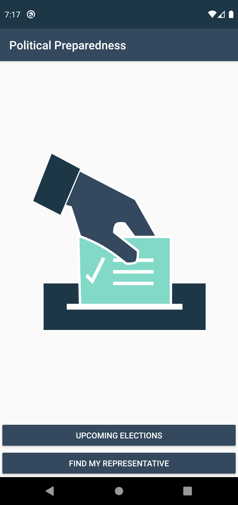
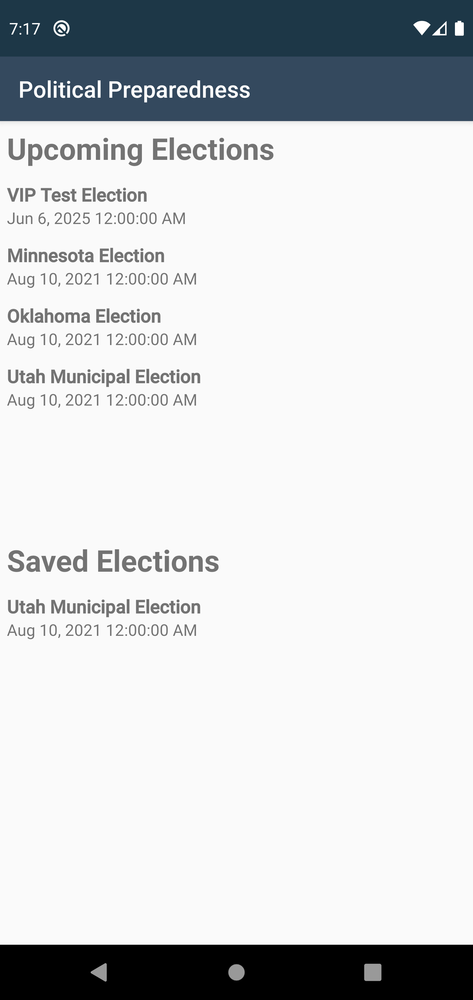
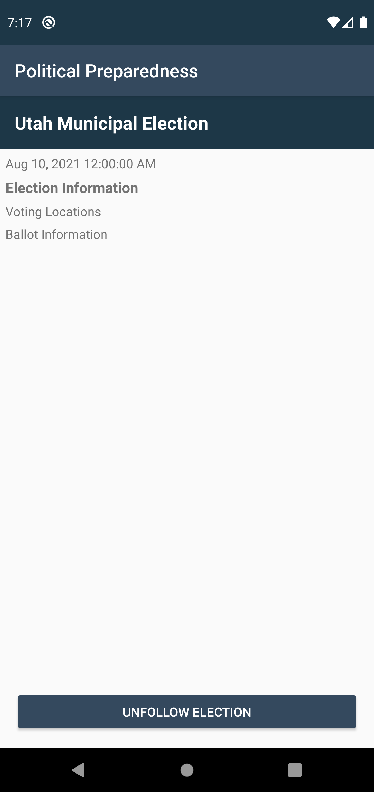
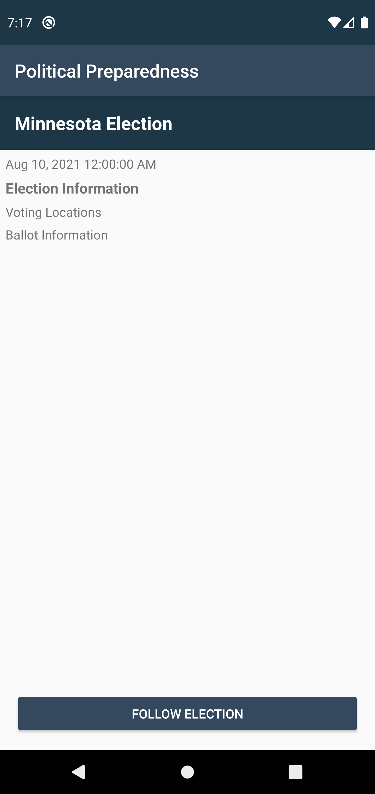
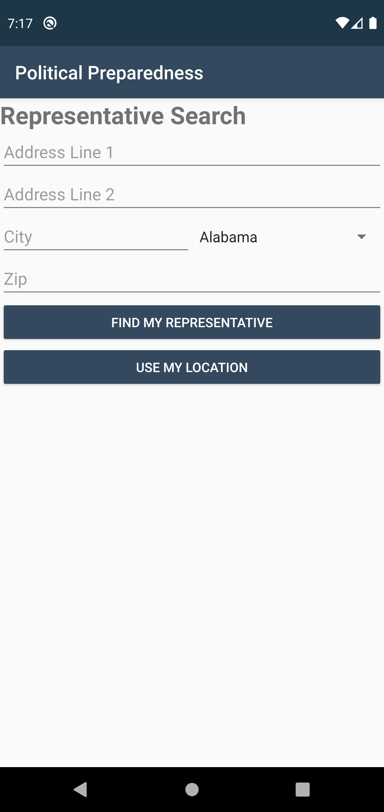
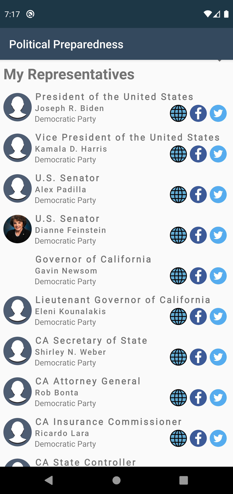

## Political Preparedness

PolitcalPreparedness is an example application built to demonstrate core Android Development skills as presented in the Udacity Android Developers Kotlin curriculum. 

This app demonstrates the following views and techniques:

* [Retrofit] to make api calls to an HTTP web service.
* [Moshi] which handles the deserialization of the returned JSON to Kotlin data objects. 
* [Glide] to load and cache images by URL.
* [Room] for local database storage.
  
It leverages the following components from the Jetpack library:

* [ViewModel]
* [LiveData]
* [Data Binding] with binding adapters
* [Navigation] with the SafeArgs plugin for parameter passing between fragments

## Screens
	
	
	

## Setting up the Repository

To get started with this project, simply pull the repository and import the project into Android Studio. From there, deploy the project to an emulator or device. 

* NOTE: In order for this project to pull data, you will need to add your API Key to the project as a value in the CivicsHttpClient. You can generate an API Key from the [Google Developers Console]

## Getting Started

* For the most part, the TODOs in the project will guide you through getting the project completed. There is a general package architecture and *most* files are present. 
* Hints are provided for tricky parts of the application that may extend beyond basic Android development skills.
* As databinding is integral to the project architecture, it is important to be familiar with the IDE features such s cleaning and rebuilding the project as well as invalidating caches. 

## Suggested Workflow

* It is recommend you save all beautification until the end of the project. Ensure functionality first, then clean up UI. While UI is a component of the application, it is best to deliver a functional product.
* Start by getting all screens in the application to navigate to each other, even with dummy data. If needed, comment out stub code to get the application to compile. You will need to create actions in *nav_graph.xml* and UI elements to trigger the navigation. 
* Create an API key and begin work on the Elections Fragment  and associated ViewModel. 
	* Use the elections endpoint in the Civics API and requires no parameters.
	* You will need to create a file to complete the step.
	* This will require edits to the Manifest.
	* Link the election to the Voter Info Fragment.
* Begin work on the Voter Info Fragment and associated ViewModel.
* Begin work on the Representative Fragment and associated ViewModel.
	* This will require edits to Gradle.
	* You will need to create a file to complete the step.

## Report Issues
Notice any issues with a repository? Please file a github issue in the repository.

License
=======

    Licensed under the Apache License, Version 2.0 (the "License");
    you may not use this file except in compliance with the License.
    You may obtain a copy of the License at

       http://www.apache.org/licenses/LICENSE-2.0

    Unless required by applicable law or agreed to in writing, software
    distributed under the License is distributed on an "AS IS" BASIS,
    WITHOUT WARRANTIES OR CONDITIONS OF ANY KIND, either express or implied.
    See the License for the specific language governing permissions and
    limitations under the License.

[Retrofit]: https://square.github.io/retrofit/
[Moshi]: https://github.com/square/moshi/
[Glide]: https://bumptech.github.io/glide/
[Room]: https://developer.android.com/training/data-storage/room/

[ViewModel]: https://developer.android.com/topic/libraries/architecture/viewmodel/
[LiveData]: https://developer.android.com/topic/libraries/architecture/livedata/
[Data Binding]: https://developer.android.com/topic/libraries/data-binding/
[Navigation]: https://developer.android.com/topic/libraries/architecture/navigation/

[Google Developers Console]: https://console.developers.google.com/
